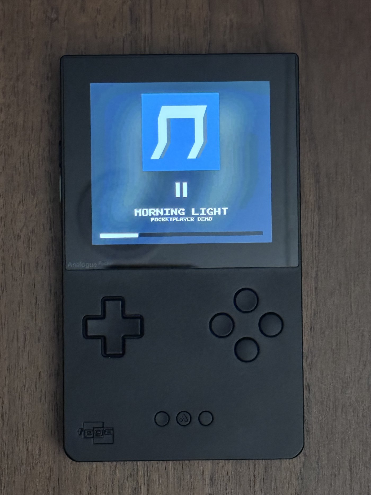
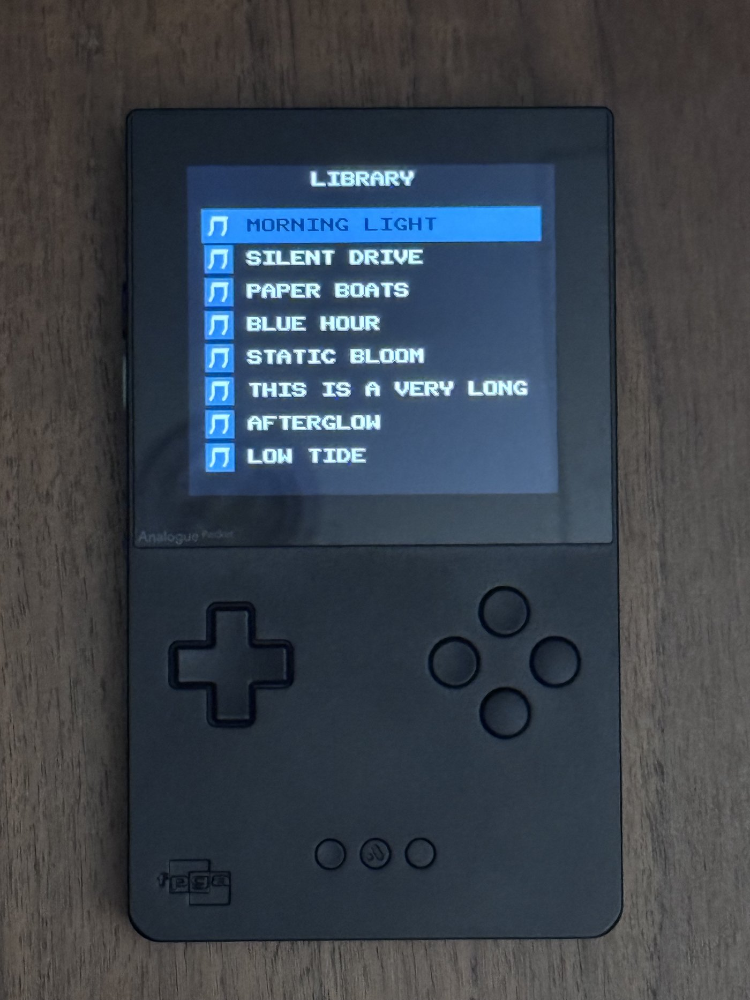

# PocketPlayer

[](https://buymeacoffee.com/mhlin6402)

A music player [openFPGA](https://www.analogue.co/developer) core for the
[Analogue Pocket](https://www.analogue.co/pocket). Build a library from your
own music files, then browse and play it entirely on the Pocket - album art,
shuffle and repeat, three Now Playing views, and a screensaver, all running
natively on the Pocket's FPGA.

If you enjoy PocketPlayer, consider [buying me a coffee](https://buymeacoffee.com/mhlin6402).

## Screenshots

Running on real Analogue Pocket hardware, with a demo library of silent
placeholder tracks.

<table>
<tr>
<td></td>
<td></td>
</tr>
<tr>
<td align="center">Now Playing</td>
<td align="center">Library</td>
</tr>
</table>

## Features

- Library of up to 512 tracks, browsable by a scrolling list with per-row
  album art (hold Up/Down to scroll fast).
- Three Now Playing views, cycled with Up/Down: a static album art view, a
  spinning-vinyl view, and a full-screen album art view.
- Shuffle and repeat (all-tracks / stop-at-end).
- A screensaver (blanks the screen, keeps playing) and a button lock (stops
  accidental presses) - each toggled by its own button and independent of
  the other.
- Several classic display filter options (CRT, various handheld LCD looks)
  available from the Pocket's own Display Mode setting.

## Requirements

- An Analogue Pocket with the [openFPGA](https://www.analogue.co/developer)
  feature enabled (running a recent Pocket OS).
- A microSD card set up for openFPGA cores (the standard `/Cores`,
  `/Assets`, `/Platforms` folder structure - if you've installed any other
  openFPGA core before, you already have this).
- To build your own library: **Python 3**, [**Pillow**](https://pypi.org/project/Pillow/)
  (`pip install Pillow`), and **ffmpeg** (with `ffprobe`) available on your
  command line.
- **No music is included with this project** - you provide your own audio
  files, which stay entirely on your own computer and SD card.

## Installation

### 1. Install the core

Copy this repo's `dist/` folder onto your SD card, merging it with what's
already there (don't replace the whole card - other cores live alongside
it). On Windows:

```
Copy-Item -Recurse -Force ".\dist\*" E:\
```

(replace `E:\` with your SD card's actual drive letter)

At this point PocketPlayer will show up in the Pocket's core list and load,
but its Library will be empty - you still need to build your own library
(next step) before there's anything to play.

### 2. Build your library

`tools/convert_audio.py` converts your own audio files (FLAC, MP3, M4A,
AAC, WAV, OGG, Opus, WMA) into the format the core reads, extracting
embedded cover art automatically. Run it from the `tools/` directory (or
adjust the paths below) with one album:

```
py convert_audio.py --dir "C:\Music\Some Album" --use-tags
```

...or several albums combined into one library:

```
py convert_audio.py --dirs "C:\Music\Album One" "C:\Music\Album Two" --use-tags
```

...or every album by several artists at once (each artist folder should
contain one subfolder per album):

```
py convert_audio.py --artist-dirs "C:\Music\Artist One" "C:\Music\Artist Two" --use-tags
```

`--use-tags` reads the track title/artist from the file's own metadata tags
(falling back to the filename if a tag is missing) - drop it to always use
filenames. This can take a while for a large library (it's decoding and
re-encoding every track) - a few hundred tracks can take 10-20+ minutes,
and needs roughly 40MB of storage per track (uncompressed audio).

When it finishes, copy the **whole `dist/` folder again** (it just updated
files inside `dist/Assets/pocketplayer/common/` and `dist/Cores/mhlin.PocketPlayer/data.json`):

```
Copy-Item -Recurse -Force ".\dist\*" E:\
```

Your library is now on the card. Re-run `convert_audio.py` and re-copy any
time you want to change your library - no Quartus or recompiling needed for
this, ever.

## Controls

| Button | NowPlaying tab | Library tab |
|---|---|---|
| D-pad Up/Down | Cycle Now Playing view (Still Thumbnail / Spinning Vinyl / Full Art) - Up and Down cycle in opposite directions | Move selection (hold to auto-repeat, ~5 rows/sec after a short delay) |
| D-pad Left/Right | Previous / next track | - |
| A | Play / pause | Select highlighted track and start playing it |
| X | Toggle shuffle | - |
| Y | Toggle repeat (all tracks / stop at end) | - |
| L / R (shoulders) | Switch to Library tab | Switch to NowPlaying tab |
| Select | Toggle the screensaver (works from either tab; music keeps playing while blanked) | |
| Start | Toggle the button lock (works from either tab; shows a "LOCKED"/"UNLOCKED" message) | |

While the screensaver is active, only Select does anything (press it again
to exit). While the button lock is active, only Start does anything (press
it again to unlock) - this is intentional, so you can't accidentally exit
one state by mashing the wrong button. The Pocket's own Display Mode filter
(CRT, handheld LCD looks, etc.) is a separate system setting, found in the
Pocket's usual Settings/Display menu, not a button on the core itself.

## Troubleshooting

- **Core doesn't show up, or the Pocket seems to ignore it entirely**: make
  sure `dist/`'s contents were copied to the SD card's *root* (so you end up
  with `/Cores/mhlin.PocketPlayer/`, `/Assets/pocketplayer/`, and
  `/Platforms/pocketplayer.json` at the top level of the card), and that no
  folder got renamed or partially copied.
- **Library is empty / no tracks show up**: you've installed the core but
  haven't built a library yet - see "Build your library" above, and check
  that step actually finished without errors (it prints a summary of every
  track it processed).
- **A previous test build's folder is still on the card under a different
  name**: if you're updating from an old copy of this project, delete any
  stale `/Cores/mhlin.<OldName>/` and `/Platforms/<oldname>.json` first, so
  you don't end up with two entries for the same core.
- **`convert_audio.py` fails immediately**: confirm `ffmpeg`/`ffprobe` are
  on your `PATH` (`ffmpeg -version` should print something) and that
  Pillow is installed (`pip install Pillow`).

For anything beyond this - building the core from source, understanding how
it works internally, or contributing changes - see
[docs/DEVELOPER_GUIDE.md](docs/DEVELOPER_GUIDE.md).

## Feedback & Support

- **Found a bug?** Open an [issue](https://github.com/MHLin6402/PocketPlayer/issues/new/choose).
  It helps a lot to include: your Pocket's firmware/OS version, what you
  were doing when it happened, and - if you can grab it - the matching log
  file from the SD card's `/System/Logs/mhlin.PocketPlayer_*.txt` (you can
  drag and drop it straight into the issue).
- **Have an idea, a question, or general feedback?** Use
  [Discussions](https://github.com/MHLin6402/PocketPlayer/discussions)
  instead - that's a better fit than an issue for anything that isn't a
  concrete bug.

## License

[MIT](LICENSE). No music or album art is included with this project - only
the FPGA core and the tools to build your own library from files you
already own.
